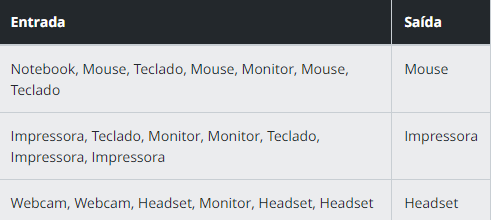

 Identificando os Produtos Mais Vendidos

 Descrição
Você está gerando um relatório de vendas em Power BI e deseja identificar quais produtos foram mais vendidos durante um dia específico. Os dados dos produtos vendidos são frequentemente armazenados em listas. Sua tarefa é usar uma lista em Python para contar a frequência de cada produto e determinar o produto mais vendido, que será usado para destacar produtos populares no relatório do Power BI.

Detalhamento:

Encontre o produto com a maior contagem:

Itere sobre o dicionário contagem, que contém a contagem de cada produto.

Compare a contagem atual com a contagem máxima armazenada em max_count.

Se a contagem atual for maior que max_count, atualize max_count e defina max_produto como o produto atual.

Converter a entrada em uma lista de strings, removendo espaços extras:

Use o método split(',') para dividir a string de entrada em uma lista de strings, separando pelo caractere vírgula.

Utilize uma list comprehension para remover espaços em branco extras ao redor de cada string, usando o método strip().

Entrada
Uma lista de strings onde cada string representa o nome de um produto vendido.

Saída
A string com o nome do produto mais vendido. Se houver empate, retorne qualquer um dos produtos mais vendidos.

Exemplos
A tabela abaixo apresenta exemplos com alguns dados de entrada e suas respectivas saídas esperadas. Certifique-se de testar seu programa com esses exemplos e com outros casos possíveis.

Atenção: É extremamente importante que as entradas e saídas sejam exatamente iguais às descritas na descrição do desafio de código.

